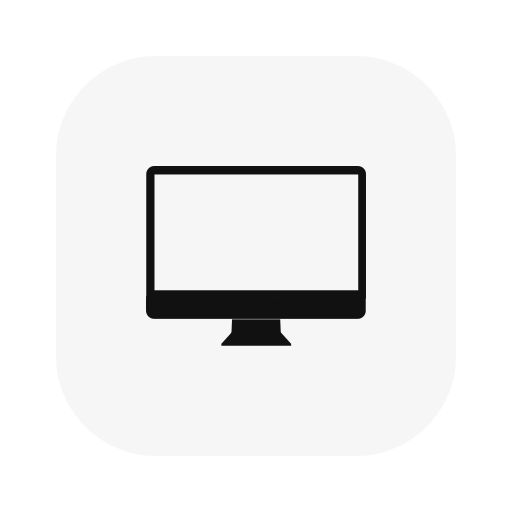
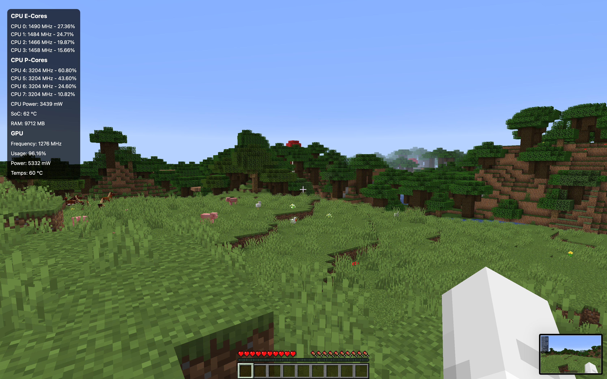

  
  <h1 style="display: inline; font-size: 2em; vertical-align: middle;">Display Monitor</h1>

### How to Use

This app is designed to provide an informative overlay, always visible on the screen, displaying information about sensors. The overlay is currently non-clickable to avoid interfering with other windows.

  
  

---

### Performance Impact

Using the overlay above video games forces them into **composited mode**, which prevents them from benefiting from **direct mode**, potentially reducing performance. To minimize performance impact, it is recommended to:

- **Enable V-Sync**
- **Disable HiDPI**

#### Performance Comparison:
- **With recommended settings** → Performance drop: **1-2% FPS**
- **Without optimizations** → Performance drop: **5-10% FPS**

If you want **zero** impact on performance, consider using one of the following methods instead:
- **Web Server**: View overlay in a browser instead of directly on the game screen.
- **File Logging**: Save overlay data to a file for later use.
- **Dedicated OBS Server**: Functions as a pre-rendered overlay web source, accessible via **OBS browser source** and any external browser.
- **Separate Physical Display**: Render the overlay on another screen.

---

### Web Server, OBS Server, and File Logging

This version introduces additional features for greater flexibility in how data is displayed and used:

1. **Web Server Mode**:
   - Run a local web server to display the overlay in a browser or external device.
   - Allows for **remote monitoring** without impacting game performance.

2. **OBS Server Mode**:
   - Functions as a **pre-rendered overlay web source**, accessible via **OBS browser source** and **external browsers**.
   - Ideal for **streaming setups** and real-time monitoring.

3. **File Logging**:
   - Save overlay data to a file in CSV format.

---

### Installation Instructions

To install the app, follow these steps:

1. Navigate to the [Releases](https://github.com/Hais00/Display-Monitor/releases) section of this repository.  
2. Download the `.dmg` file for the latest version.  
3. Open the `.dmg` file, and you'll find the app alongside a shortcut to the Applications folder.  
4. Drag and drop the app into the **Applications** folder shortcut to complete the installation.  
5. Launch the app from your Applications folder.  

---
