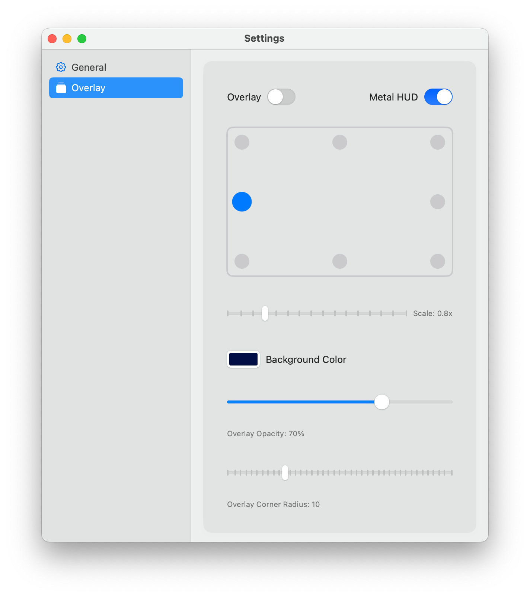
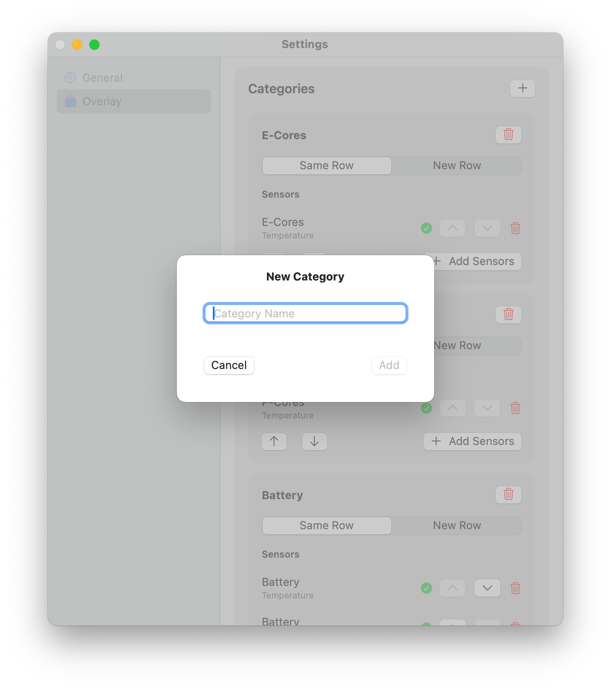
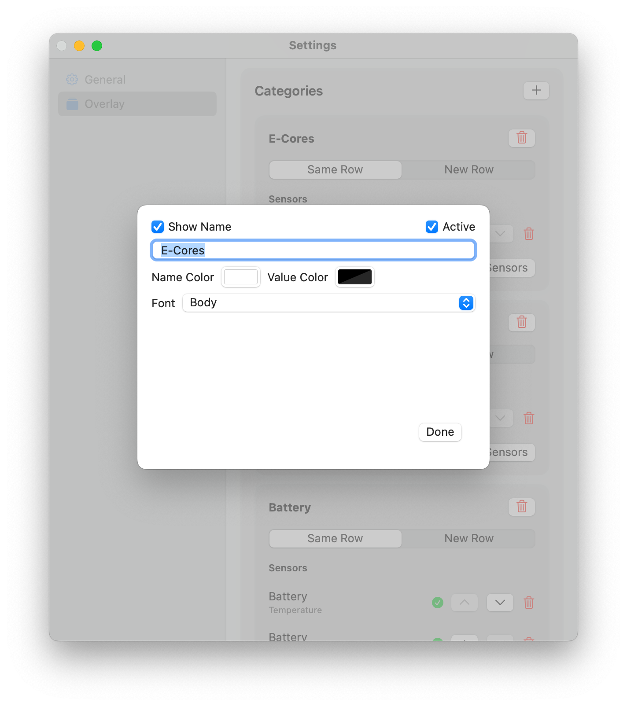
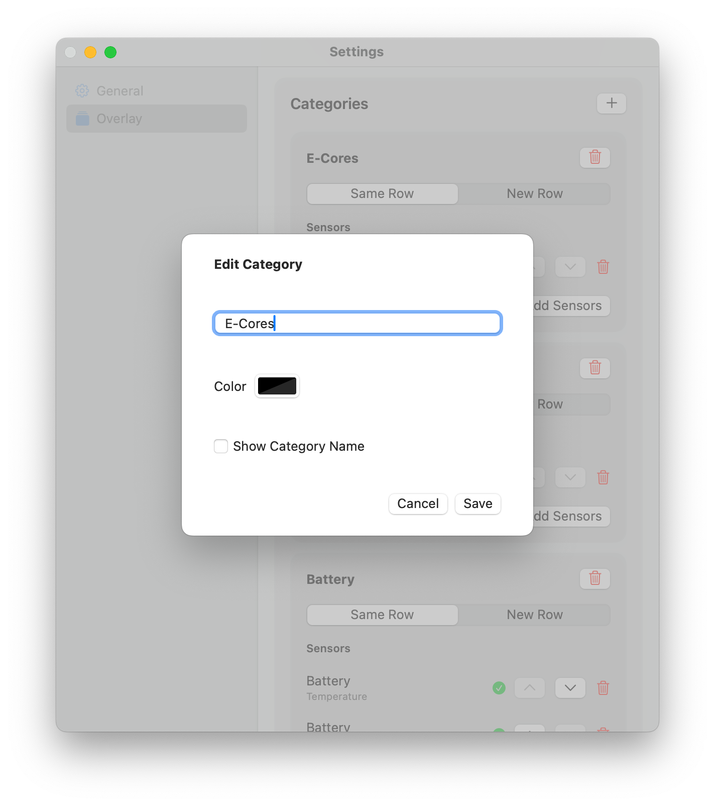

  
  <h1 style="display: inline; font-size: 2em; vertical-align: middle;">Display Monitor</h1>

### How to Use

This app is designed to provide an informative overlay, always visible on the screen, displaying information about sensors. The overlay is currently non-clickable to avoid interfering with other windows.

  
  

### Requirements and Permissions
To fully utilize the app, ensure the following requirements are met:

1. **Apple Silicon**: Tested on M1/M4, but it may work on other Apple Silicon models.
2. **Accessibility Permissions**: Go to `System Preferences > Security & Privacy > Accessibility` and add the app to allow the overlay functionality.
3. **Administrator Password**: Required for using `powermetrics`, which collects system data.

### Key Features
- **Persistent Overlay**: The overlay remains visible at all times, providing continuous monitoring of system metrics.
- **Metal Overlay Integration**: While the app is running, it activates Metal's overlay to show information on FPS and GPU metrics on Metal games.
- **Extensive Personalization**: Customize the overlay to suit your preferences and needs:
  - **General Overlay Customization**:
    - Adjust **background color**, **size**, **position**, **border rounding**, and **opacity**.
    

  - **Category Customization**:
    - Create and manage **categories** to organize sensors.
    

    - Customize each category's **name**, **color**, and decide whether to display the **category name**.
    

    - Choose how categories are displayed: **new row** or **same row**.
  - **Sensor Customization**:
    - Personalize individual sensors with options to modify the **name**, **color**, and choose whether to display the sensor **name**.
    

This app was developed for fun and is not intended for professional use, though it can be useful for keeping an eye on system performance.

### Installation Instructions
To install the app, follow these steps:

1. Navigate to the [Releases](#) section of this repository or access the main branch directly.
2. Download the ZIP file containing the app.
3. Extract the app.
4. Open.
